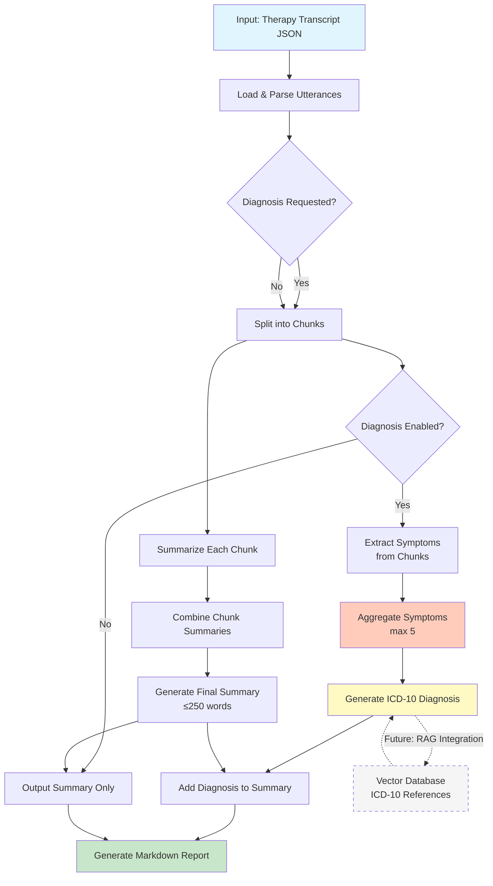

# `concisum`

`concisum` is a CLI tool that analyzes therapy session transcripts using LLMs to generate comprehensive summaries and optionally ICD-10 diagnoses. It's designed to assist mental health professionals in documenting and analyzing therapy sessions through hierarchical summarization.

## Features

- **Hierarchical summarization**: Processes long transcripts by breaking them into chunks, summarizing each chunk, then creating a comprehensive summary
- **Optional ICD-10 diagnosis generation**: Extracts symptoms and generates diagnoses (Chapter V, F00-F99) with justifications
- **Flexible input support**: Handles multiple JSON transcript formats
- **Local LLM inference**: Uses Ollama-compatible endpoints via `pydantic-ai`
- **Structured output**: Generates markdown reports with summaries, diagnoses, and identified symptoms
- **Word count optimization**: Ensures final summaries stay under 250 words

## How It Works



## Prerequisites

- Python 3.11 or higher
- Ollama-compatible LLM endpoint (configured for `qwen3:8b` by default)
- `uv` package manager (https://github.com/astral-sh/uv)

## Installation

1. Clone the repository:
```bash
git clone https://github.com/yourusername/concisum.git
cd concisum
```

2. Create and activate a virtual environment using uv:
```bash
uv venv
source .venv/bin/activate  # On Windows: .venv\Scripts\activate
```

3. Install the package:
```bash
uv sync
```

## Configuration

The tool expects an Ollama-compatible endpoint. By default, it's configured to use:
- Model: `qwen3:8b`
- Endpoint: `http://localhost:11434/v1`

To modify these settings, edit `concisum/config.py` or set the `OLLAMA_HOST` and `OLLAMA_MODEL` environment variables.

## Usage

### Basic Command

```bash
concisum <input_file> [options]
```

### Options

- `-o, --output`: Specify output markdown file path (default: `<input>_summary.md`)
- `-d, --diagnosis`: Generate ICD-10 diagnosis from transcript
- `--no-rag`: Disable RAG for diagnosis generation (currently no effect as RAG is not implemented)
- `-v, --verbose`: Enable verbose logging
- `--help`: Show help message

### Examples

Generate summary only:
```bash
concisum transcript.json -o summary.md
```

Generate summary with ICD-10 diagnosis:
```bash
concisum transcript.json -d -o session_analysis.md -v
```

### Input Format

The tool accepts JSON files in two formats:

**Format 1** (diarizationlm output):
```json
{
  "utterances": [
    {
      "ref_text": "utterance text",
      "ref_spk": "SPEAKER_00"
    }
  ]
}
```

**Format 2** (whisper/verbatim output):
```json
{
  "utterances": [
    {
      "text": "utterance text",
      "speaker": "SPEAKER_1"
    }
  ]
}
```

### Output

The tool generates a markdown file containing:

1. **Session Summary** (always included)
   - Comprehensive summary of the therapy session
   - Key themes and interventions
   - Limited to 250 words

2. **ICD-10 Diagnosis** (if `-d` flag is used)
   - Complete diagnosis with code and description
   - Diagnostic justification
   - Confidence score (0-1)

3. **Identified Symptoms** (if diagnosis is generated)
   - List of up to 5 key symptoms
   - Descriptions and evidence from transcript

Example output structure:
```markdown
# Therapiesitzung Zusammenfassung

[Comprehensive session summary...]

## Diagnose

### ICD-10 Diagnose
F32.1 - Mittelgradige depressive Episode

### Begründung
[Detailed diagnostic reasoning...]

### Diagnosesicherheit
0.85

## Identifizierte Symptome

### Depressive Stimmung
**Beschreibung:** [...]
**Belege:** [...]
```

## Architecture

The tool uses a hierarchical approach to handle long transcripts:

1. **Chunking**: Splits transcript into manageable chunks (default: 50 utterances)
2. **Chunk Summarization**: Each chunk is summarized independently
3. **Summary Aggregation**: Chunk summaries are combined into a final summary
4. **Symptom Extraction**: (Optional) Symptoms are extracted from chunks in parallel
5. **Diagnosis Generation**: (Optional) ICD-10 diagnosis based on aggregated symptoms

## Future Features

- **RAG-based Diagnosis Enhancement**: Integration with a vector database containing ICD-10 reference materials to improve diagnostic accuracy (placeholder code exists but not yet implemented)
- **Multi-language support**: Extend beyond German language processing
- **Custom chunking strategies**: Semantic or speaker-based chunking
- **Diagnostic differential generation**: Multiple potential diagnoses with probabilities

## Development

The project structure:
```
concisum/
├── cli.py              # CLI interface
├── config.py           # Model configuration
├── load_json.py        # Input file parsing
├── summary/
│   ├── agents.py       # Summarization agents
│   └── models.py       # Summary data models
└── diagnosis/
    ├── agents.py       # Diagnosis generation agents
    └── models.py       # Diagnosis data models
```
